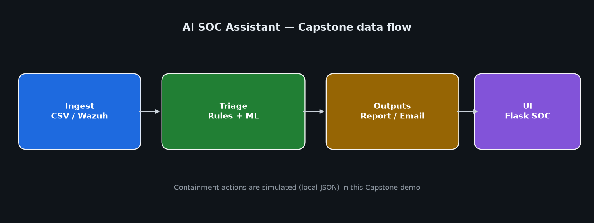
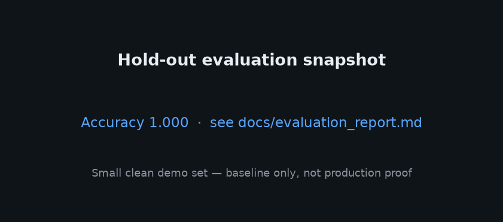

# AI SOC Assistant (Capstone)

Allan Munyira's capstone project: an **AI-assisted SOC triage** toolkit that combines rule-based analysis with a scikit-learn model, a Flask dashboard (login + email OTP), a CLI watcher for CSV logs, and optional Wazuh API integration.

## Features

- Train an ML severity model from sample security logs
- CLI menu to train, watch CSV/Wazuh feeds, view reports, and manage blocks
- Flask dashboard for training, watchers, reports, blocks, and analytics
- Email notifications for high/critical events (Gmail SMTP / App Password)
- Optional Wazuh 4.x API alert fetch


## Live demo

Follow the short defense / portfolio script: [docs/DEMO.md](docs/DEMO.md).

Suggested captures live in [docs/screenshots/](docs/screenshots/). Starter assets:






## Architecture

See [docs/ARCHITECTURE.md](docs/ARCHITECTURE.md) for the system diagram and component table.

Flow (short): **CSV / Wazuh** → **rules + ML triage** → **report / simulated blocks / email / Flask UI**.

## Setup

```bash
python -m venv .venv

# Windows
.venv\Scripts\activate

# macOS / Linux
source .venv/bin/activate

pip install -r requirements.txt
copy .env.example .env   # Windows
# cp .env.example .env   # macOS / Linux
```

Edit `.env` and set `SECRET_KEY`, mail credentials, and (optionally) Wazuh values. **Never commit `.env`.**


## Tests

```bash
pip install -r requirements.txt
pytest -q
```

Covers severity rules, Wazuh alert parsing, a **mocked Wazuh API client** (no live network), NLP helpers, and simulated containment. Latest quiet run is saved under [docs/screenshots/07-pytest.txt](docs/screenshots/07-pytest.txt).

## Model evaluation

Run an honest hold-out evaluation (same feature pipeline as training):

```bash
python evaluate_model.py
```

This prints a classification report and writes [docs/evaluation_report.md](docs/evaluation_report.md) (accuracy, F1, confusion matrix, limitations).

For an honest **capstone vs production** read of the ML severity model (tiny dataset, perfect demo scores, next steps), see [docs/MODEL_ASSESSMENT.md](docs/MODEL_ASSESSMENT.md).

## Train the model

```bash
python train_model.py
```

This reads `data/sample_logs.csv` and writes `soc_model.pkl`, `vectorizer.pkl`, `scaler.pkl`, and `label_encoder.pkl` in the project root.

## Run the CLI

```bash
python soc_triage_cli.py
```

Menu options: train, watch CSV, watch Wazuh, view report, unblock entities, exit.

## Run the dashboard

```bash
python dashboard.py
```

Open [http://127.0.0.1:5000](http://127.0.0.1:5000). Register with an email address (used for OTP), then log in.

Flask templates live under `templates/` (login, register, 2FA, home, reports, etc.).

## Wazuh (optional)


### Wazuh watcher

1. Copy `.env.example` to `.env` and set `WAZUH_API`, `WAZUH_USER`, `WAZUH_PASS`.
2. Train once (`python train_model.py`) so triage has a model.
3. CLI: choose **Watch Wazuh Alerts**, or in the dashboard start the Wazuh watcher / open **Wazuh logs**.
4. Alerts are parsed into rule/agent/severity fields when the API returns them; triage still accepts plain strings.

If `WAZUH_PASS` is empty, auth is skipped and the watcher returns no alerts (safe offline demo).

## Wazuh (optional)

Set in `.env`:

- `WAZUH_API` (default `https://localhost:55000`)
- `WAZUH_USER` (default `wazuh`)
- `WAZUH_PASS` (**required** for live auth; empty disables usable authentication)

Without a password, Wazuh calls will fail gracefully and return no alerts.

## Security notes

- Secrets are loaded from environment variables via `python-dotenv` (`.env`).
- **Rotate any previously exposed Gmail App Password** (and Wazuh API password if it was shared in older copies of this project).
- Do not commit real passwords, App Passwords, or API tokens.
- Treat this as a **local demo / academic** project, not production SOC tooling.

## Ops / Safety (auto-containment)

Automatic IP/user blocks from triage **require rule + ML agreement** (or rules marking **critical**). When the model is used, confidence must be ≥ `ML_CONFIDENCE_THRESHOLD` (default **0.70** in `.env.example`). If rules and the model disagree, or confidence is low, containment is **skipped** and the report/console shows a short note such as *“Containment skipped — model and rules did not agree.”* Manual block/unblock from the dashboard is unchanged. Containment modes (`simulated` / preview / stub) still do not talk to a real firewall unless you point stub at one.

## Project layout

| Path | Role |
|------|------|
| `dashboard.py` | Flask web UI |
| `soc_triage_cli.py` | Interactive CLI + triage pipeline |
| `train_model.py` | ML training |
| `triage_engine.py` | Rule + ML analysis helpers |
| `wazuh_integration.py` | Wazuh API client |
| `nlp_utils.py` | IP/user extraction helpers |
| `data/sample_logs.csv` | Sample training / watch data |

## Known limitations

- **Wiring fragility:** The dashboard imports CLI helpers (`train_ml_model`, `watch_csv`, `watch_wazuh`, block helpers, `blocked_entities`, `REPORT_FILE_CSV`). If those names drift again, the UI prints `SOC import error` and related actions stop working.
- **`apply_triage.py` directory:** On the Capstone Desktop copy, `apply_triage.py` is a **folder**, not a script. Use `soc_triage_cli.py` as the CLI entrypoint.
- **Demo bind / debug:** `dashboard.py` uses `debug=True` and `host="0.0.0.0"` for local demos only — do not expose that on an untrusted network.
- **Blocking is simulated:** Block/unblock updates local JSON state; it does not change firewall rules.
- **Academic / demo scope:** Treat this as a learning project, not production SOC automation.


## License

Capstone / academic use. Contact the author for other licensing.
