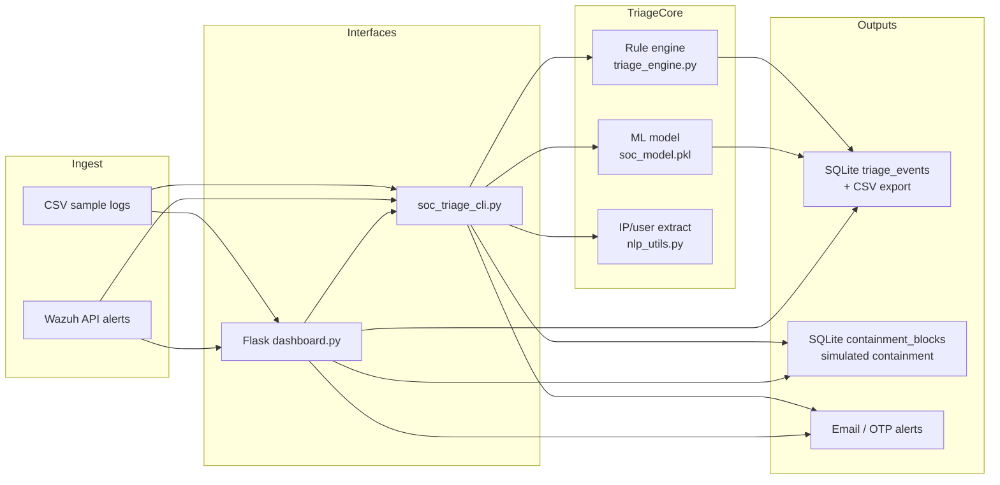

# Architecture — AI SOC Assistant

## Overview

The Capstone **AI SOC Assistant** helps an analyst triage security events by combining:

1. **Rule-based** severity / recommendation logic (`triage_engine.py`)
2. **ML severity classification** (logistic regression on TF-IDF + simple numeric features)
3. **Ingest** from CSV sample logs and optional **Wazuh** API alerts
4. **Outputs** to triage reports, simulated block lists, email alerts, and a Flask dashboard

## Data-flow diagram

## Components

| Component | Role |
| --- | --- |
| `train_model.py` | Train TF-IDF + logistic regression; save `.pkl` artifacts |
| `evaluate_model.py` | Honest hold-out metrics → `docs/evaluation_report.md` |
| `triage_engine.py` | Keyword/rules severity + ML predict helpers |
| `soc_triage_cli.py` | CLI: train, watch CSV/Wazuh, report, unblock |
| `wazuh_integration.py` | JWT auth, endpoint probe/cache, structured alerts |
| `dashboard.py` | Login, account approval, email OTP, watchers, reports, Wazuh table |
| `containment.py` | Block/unblock with `simulated` / `dry_run` / `stub`/`live` + preview→confirm + SQLite audit |
| `db.py` | SQLite schema, migration, export helpers |
| `templates/` | UI pages |
| `data/sample_logs.csv` | Labeled demo dataset |

## Containment modes

Set `CONTAINMENT_MODE` in `.env`. Full operator guide: [CONTAINMENT.md](CONTAINMENT.md).

| Mode | Behavior |
| --- | --- |
| `simulated` (default) | One-click update of SQLite `containment_blocks` only |
| `dry_run` | Append SQLite `containment_audit` only — no list changes (UI: Preview mode) |
| `stub` / `live` | Admin preview → confirm; optional POST to `CONTAINMENT_STUB_URL` (+ optional Bearer `CONTAINMENT_STUB_TOKEN`), then SQLite |

None of these are a production firewall unless you intentionally point `stub`/`live` at a real control-plane API.

## Containment note (scope)

Default **simulation** records decisions in SQLite for the capstone demo. Integrated mode can POST to a lab webhook or local echo stub after **admin confirmation** — still not an unattended production firewall.

## Security notes

- Secrets (`WAZUH_PASS`, mail app passwords, `SECRET_KEY`) come from `.env` — never commit `.env`.
- Dashboard `debug=True` / bind-all interfaces are for local demo only.

## Storage

See [STORAGE.md](STORAGE.md) for SQLite paths, legacy migration, and Postgres notes.
